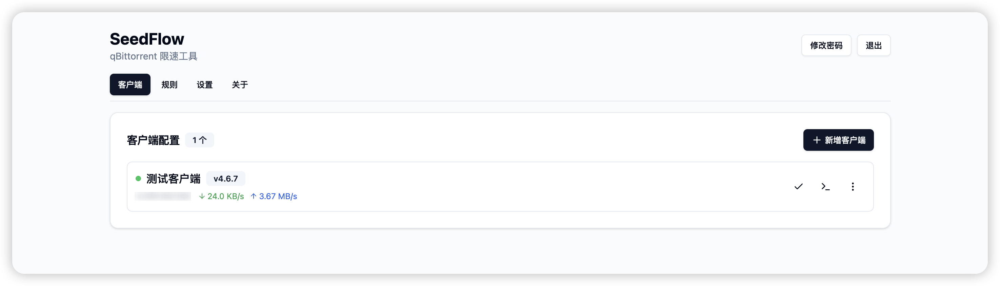
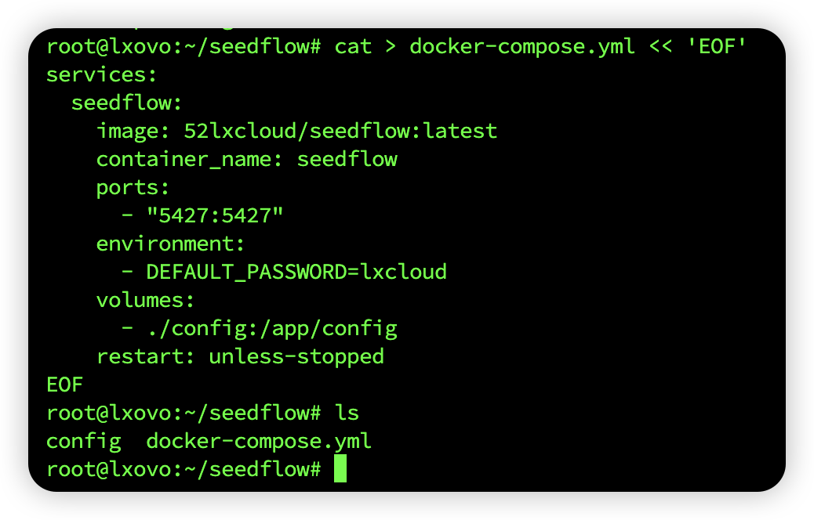
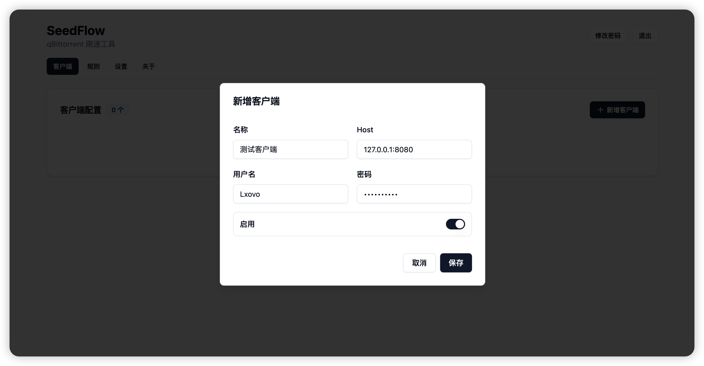
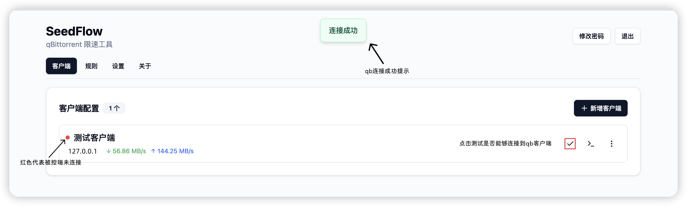
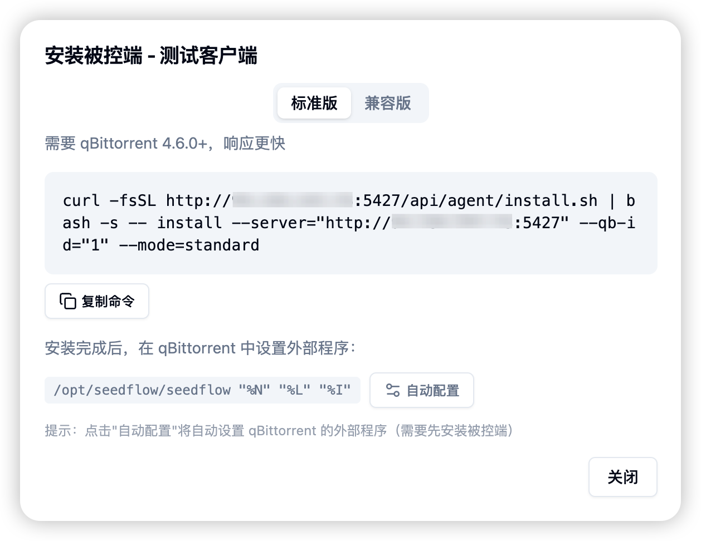
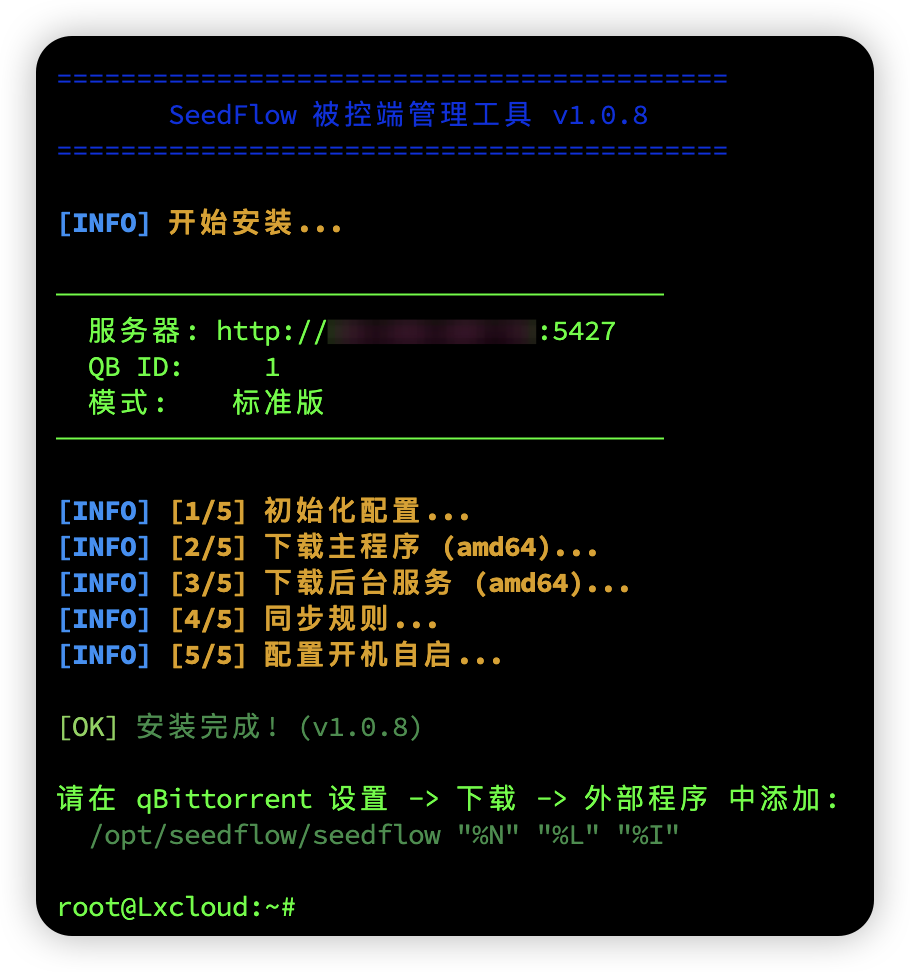
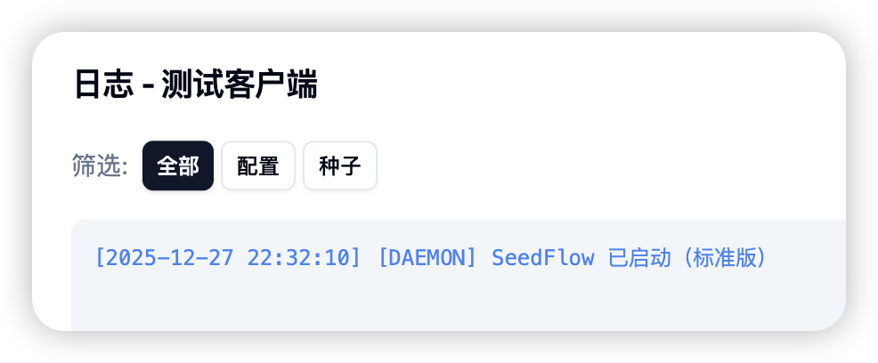
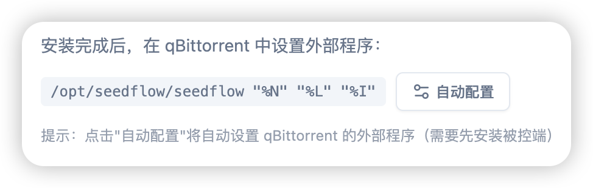

<div align="center">
  

  # SeedFlow

  **高效管理 qBittorrent 客户端，支持限速、打标签和 Docker 部署**

  <p>
    
    
  </p>

  <p>
    <a href="https://www.lxink.cn/posts/share/seedflow">完整教程</a> • 
    <a href="#部署-seedflow"> 部署 SeedFlow</a> • 
    <a href="#部署服务端"> 部署服务端</a> • 
    <a href="#部署被控端-agent"> 部署被控端</a> • 
    <a href="https://t.me/Lx_hub">联系我</a>
  </p>
</div>


一款面向多 qBittorrent 客户端的限速与标签自动化管理工具

## 写在前面
### 为什么要做 SeedFlow？

如果你手上有 多台 VPS / NAS / 盒子，相信你都遇到过这些问题：
- 不同站点限速策略不同手动改很麻烦
- 不同站点发种时偶尔忘了限速导致超速封号
- 新种子忘记打标签观感不好
- 服务器多了以后不知道哪台还活着（指qB

SeedFlow 的出现就是为了解决这些问题：
- 一个 Web 面板，统一管理所有 qB
- 用「规则」而不是「手动操作」控制限速
- 自动根据 Tracker 打标签
- 被控端一条命令部署，支持新/旧版本qB

---

### SeedFlow 能做什么

适用于
- 经常发种忘了限速（~~我本人~~
- 有 2 台及以上 qBittorrent 客户端的用户
- PT / BT 用户，希望精细化限速
- 不想写脚本，但想要「自动化」的人

## 部署 SeedFlow

### 准备环境
- 一台服务器 / NAS
- 已安装：
  - Docker
  - docker-compose（可选）

### 小建议
> 如果你使用的国外服务器，我个人不推荐你安装在家里的NAS上  
> 大部分人家里的公网v4都被回收了，当然本地qB使用就无所谓  
> `部署优先级：国外服务器 > qB自身服务器 > 家里云Nas`

### 部署服务端

#### 方法一 

**Docker Compose**（推荐）

##### 1. 创建程序所需目录

```
mkdir -p seedflow && cd seedflow
mkdir -p config
```


> seedflow 是主程序目录，config 用于持久化配置文件

##### 2.	创建 Docker编排文件

```
cat > docker-compose.yml << 'EOF'
services:
  seedflow:
    image: 52lxcloud/seedflow:latest
    container_name: seedflow
    ports:
      - "5427:5427"
    environment:
      - DEFAULT_PASSWORD=lxcloud
    volumes:
      - ./config:/app/config
    restart: unless-stopped
EOF
```

> `DEFAULT_PASSWORD` 是初始登录密码可以自行修改替换，或首次登录后请务必修改



可以使用`ls`命令查看当前目录文件，有这两条就正常

##### 3.	拉取最新镜像并启动容器
```
docker-compose pull && docker-compose up -d
```


#### 方法二

**Docker run**

```
mkdir -p config
docker run -d \
  --name seedflow \
  -p 5427:5427 \
  -v ./config:/app/config \
  --restart unless-stopped \
  52lxcloud/seedflow:latest
```

启动完成后访问：

- http://你的IP:5427

- 默认登录密码：`lxcloud`

### 添加qB客户端

1. 进入 SeedFlow面板
2. 点击「新增客户端」
填写以下信息：

- **Host（IP:端口）**  
  - 如果 SeedFlow 与 qB 在同一台服务器上，可使用 `127.0.0.1` 或 `localhost`
- **用户名 / 密码**  



3. 点击「测试连接」确认可用




### 部署被控端 Agent

1.  点击「测试连接」旁边的 **终端图标**  
2. 点击「复制安装命令」  
部分浏览器可能需要手动复制命令



3. 前往 **需要被管理的 qB 服务器**，执行复制的安装命令



4. 安装完成后，你将看到以下状态变化：
- Agent 自动启动
- 面板中「心跳状态」由 **红色** 变为 **绿色**
- 日志中显示对应模式已成功启动



5. **qBittorrent 4.6.0 及以上版本额外配置**

安装完成后，需要在 qBittorrent 中配置「外部程序」

安装命令的面板中点击 **「自动配置」**，一键完成设置（推荐）。



### 两种模式说明

| 模式 | 支持的 qB 版本 | 工作方式 | 特点 |
|------|----------------|----------|------|
| 标准版（推荐） | ≥ 4.6.0 | 通过「外部程序」触发 | 实时性好，性能开销低 |
| 兼容版 | 所有版本 qB | 轮询检测 | 兼容性最好 |
---


## 写在最后

SeedFlow 更像是一个「qB 自动化中枢」，出发的点也只是为了各位PTer在发种时，不要因为各个站点的规则不同，从而忘了设置限速，导致账号被封禁 

这篇文章写了我一个通宵，根据自己实际情况，已按最小入门版进行解释，为了适配各平台规则，我又重新简要的提取了些精确内容，和重新上传图床

本文为简化入门说明版，如需查看**完整说明、更新内容及最佳阅读体验**

请前往我的博客阅读原文： [SeedFlow使用教程](https://www.lxink.cn/posts/share/seedflow)

如有疑问，欢迎留言
